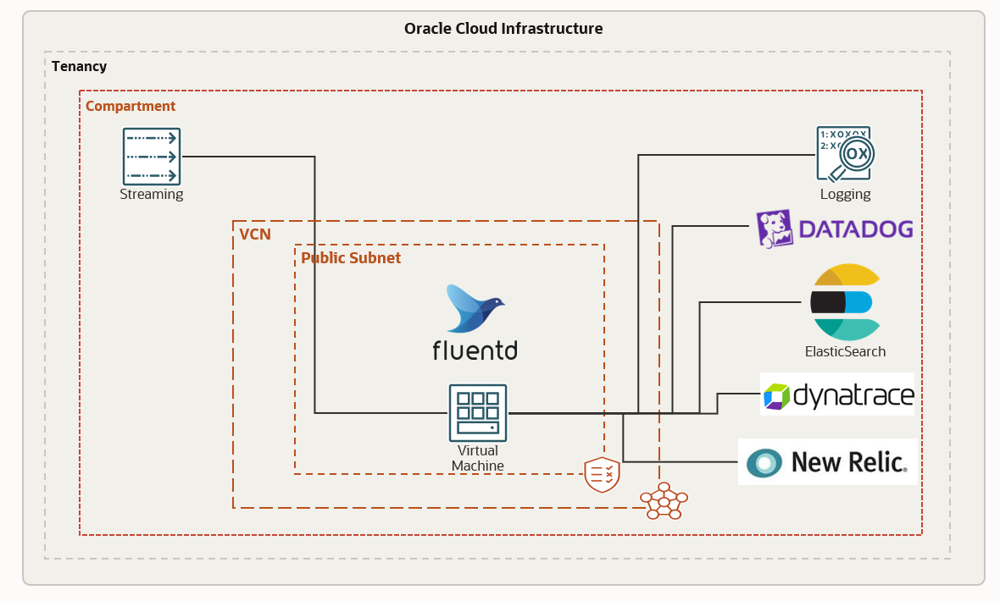

# oci-oss-fluentd

FluentD is an open source tool for forwarding and aggregating logs. FluentD ecosystem provides input and output plugins which can be used to move the logs from source to destination. In this solution we will look at how we can use fluentD to move logs from Oracle streams (Kafka compatible) to OCI Logging or Data Dog.


## Prerequisites

- Permission to `manage` the following types of resources
    - VCNS, InternetGateways, RouteTables, Subnets
    - Compute Instances
    - Stream Pools
    - Streams
    - Log groups and Log objects

- Quota to create the above resources.

If you don't have the required permissions and quota, contact your tenancy administrator. See [Policy Reference](https://docs.cloud.oracle.com/en-us/iaas/Content/Identity/Reference/policyreference.htm), [Service Limits](https://docs.cloud.oracle.com/en-us/iaas/Content/General/Concepts/servicelimits.htm), [Compartment Quotas](https://docs.cloud.oracle.com/iaas/Content/General/Concepts/resourcequotas.htm).

## Deploy Using Oracle Resource Manager

1. Click [](https://cloud.oracle.com/resourcemanager/stacks/create?region=home&zipUrl=https://github.com/oracle-quickstart/oci-oss-fluentd/releases/latest/download/oci-oss-fluentd-latest.zip)

    If you aren't already signed in, when prompted, enter the tenancy and user credentials.

2. Review and accept the terms and conditions.

3. Select the region where you want to deploy the stack.

4. Follow the on-screen prompts and instructions to create the stack.

5. After creating the stack, click **Terraform Actions**, and select **Plan**.

6. Wait for the job to be completed, and review the plan.

    To make any changes, return to the Stack Details page, click **Edit Stack**, and make the required changes. Then, run the **Plan** action again.

7. If no further changes are necessary, return to the Stack Details page, click **Terraform Actions**, and select **Apply**. 


## Deploy Using the Terraform CLI

### Clone the Module
Now, you'll want a local copy of this repo. You can make that with the commands:

    git clone https://github.com/oracle-quickstart/oci-oss-fluentd
    cd oci-oss-fluentd
    ls

### Set Up and Configure Terraform

1. Complete the prerequisites described [here](https://github.com/cloud-partners/oci-prerequisites).

2. Create a `terraform.tfvars` file, and specify the following variables:

```
# Authentication
tenancy_ocid         = "<tenancy_ocid>"
current_user_ocid    = "<user_ocid>"
fingerprint          = "<finger_print>"
private_key_path     = "<pem_private_key_path>"

# Region
region = "<oci_region>"

# Compartment
compartment_ocid = "<compartment_ocid>"

# which fluentd output plugin to use 
fluentD_output_plugin = "<OCI_LOGGING or DATA_DOG>"

# API key required to push data to DATA DOG, required only if output plugin is DATA_DOG 
data_dog_api_key = "<API key provided by DATA DOG>"

````

### Create the Resources
Run the following commands:

    terraform init
    terraform plan
    terraform apply

### Destroy the Deployment
When you no longer need the deployment, you can run this command to destroy the resources:

    terraform destroy


## Post Deployment
To test the setup push logs to the Oracle streams and you will be able to see the logs appearing in the destination.


## Quick Start Architecture 

> **_NOTE:_**  This setup is only for demonstration purpose. 




